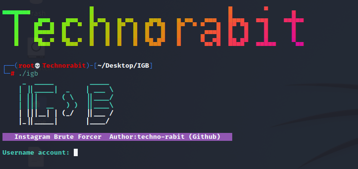

## Installation :

## Step 1 : Download and install Tor 
* `apt-get install tor`
#### > INSTALL :
* `git clone git://github.com/techno-rabit/igb.git`
* `cd igb`
* `chmod +x igb`
#### > Run : ``./igb``

## Find us on :

